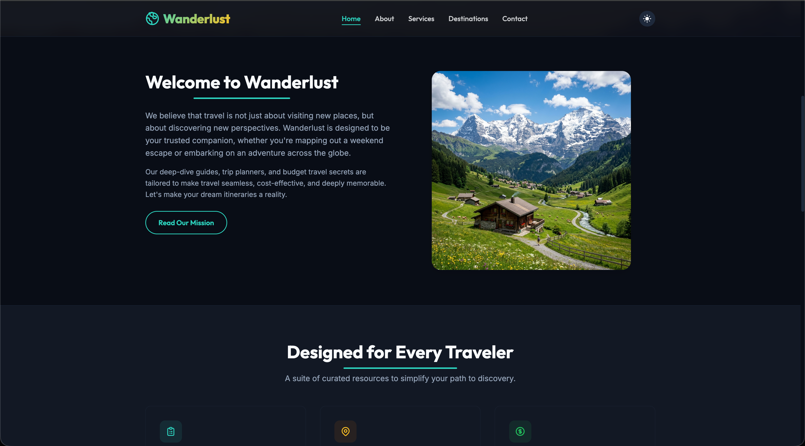
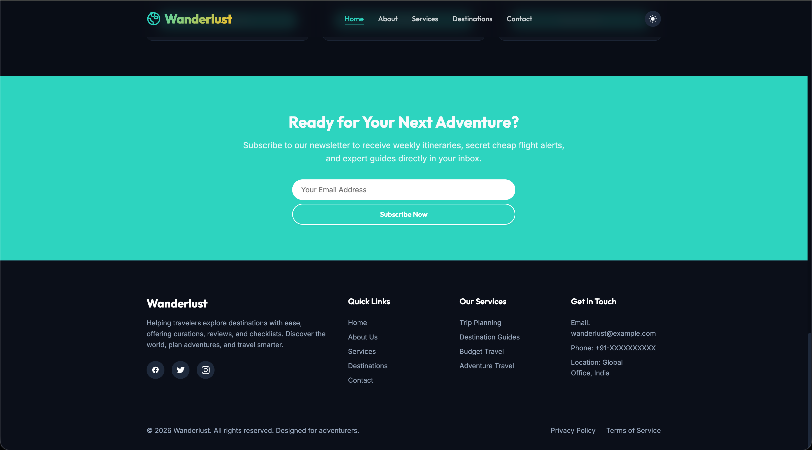
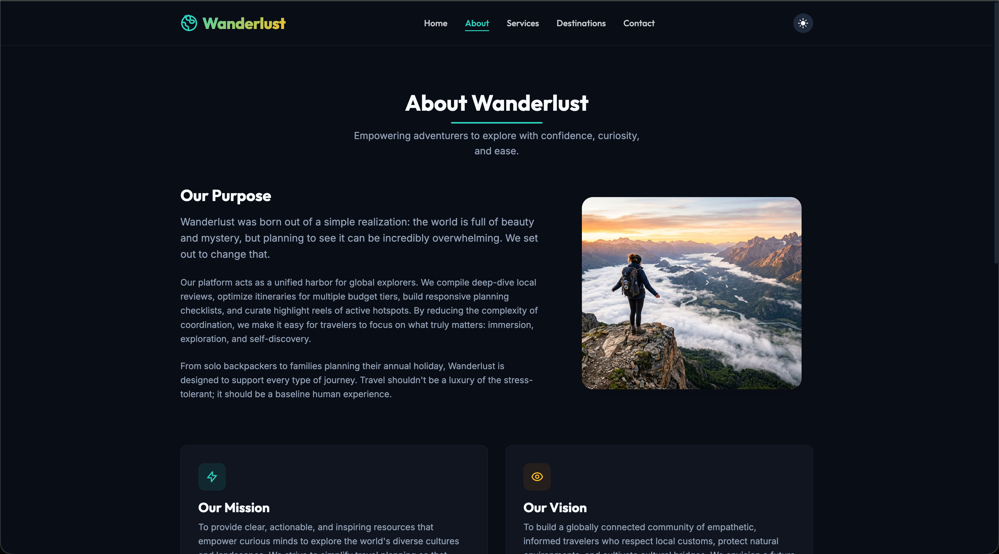
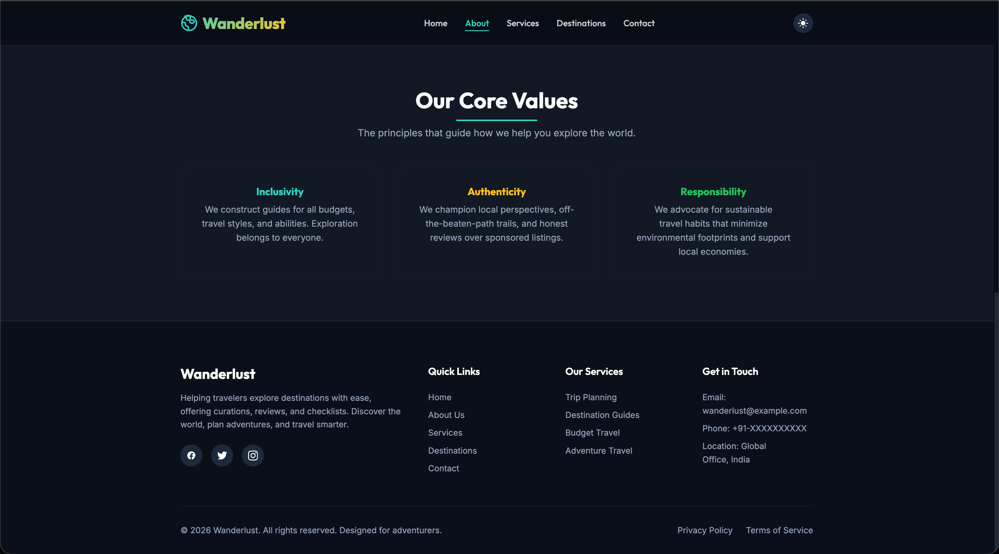
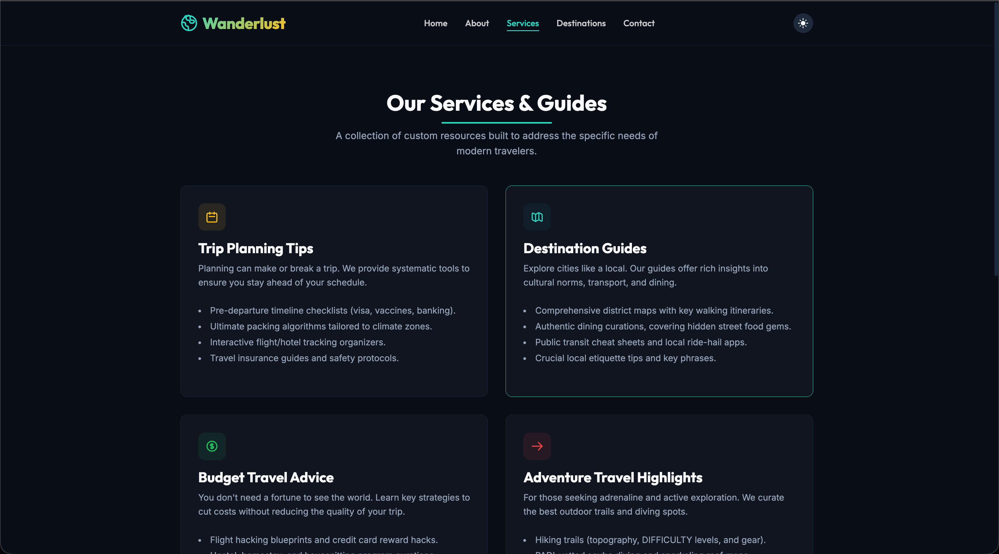
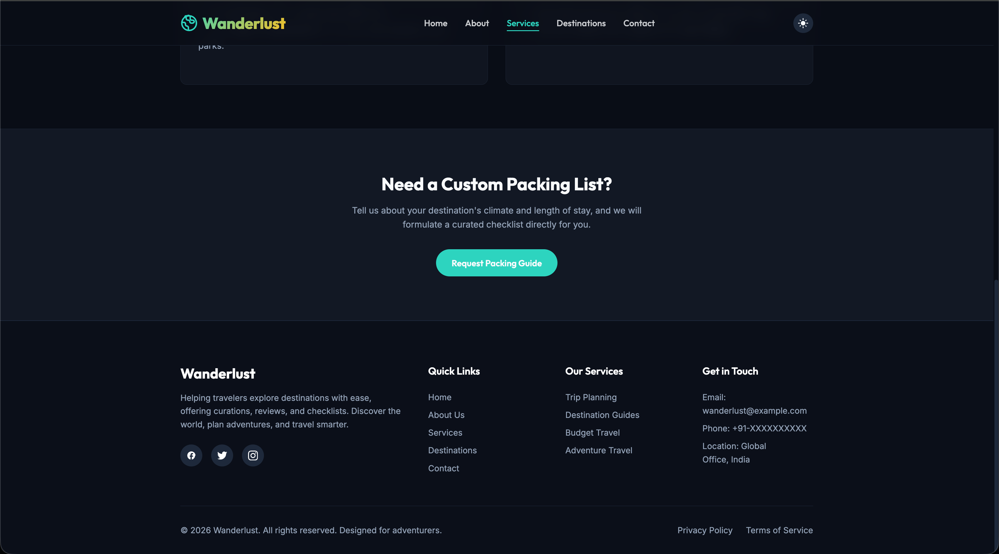
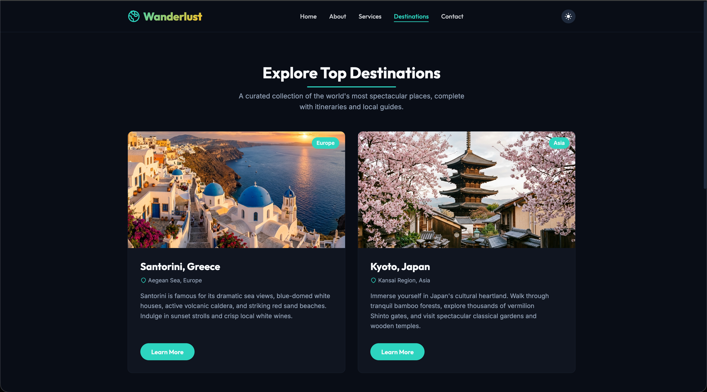
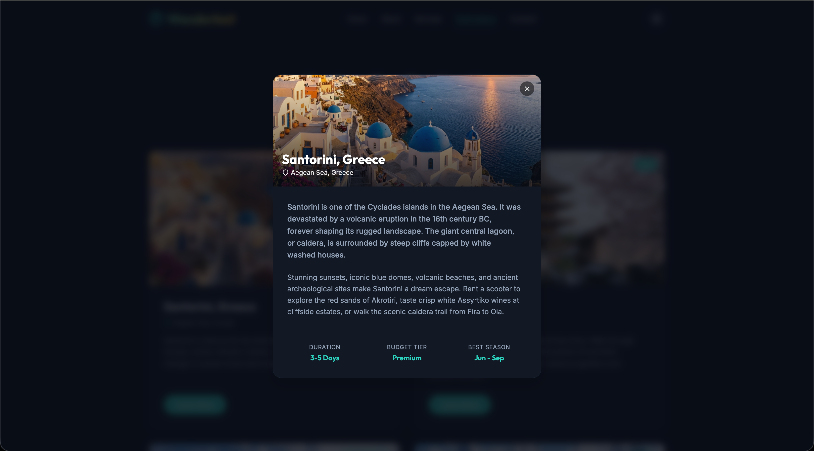
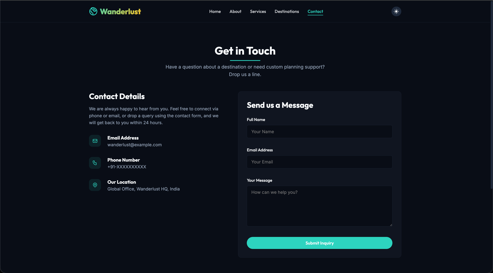

# 🌍 Wanderlust – Explore the World

[](https://maheswara660.github.io/Wanderlust/)
[](LICENSE)
[](#)

Wanderlust is a premium, fully responsive, static travel website designed to empower travelers to explore destinations with ease. Featuring immersive visual layouts, fluid dark-mode transitions, interactive destination modals, and client-side validation, this project represents the intersection of AI-assisted design and modern frontend development.

This repository was created for **Task 3 – AI Website Generation** of the AI Web Development Internship at **InAmigos Foundation**.

---

## 🗺️ Table of Contents
1. [Key Features](#-key-features)
2. [Aesthetics & UX Design](#-aesthetics--ux-design)
3. [Project Directory Structure](#-project-directory-structure)
4. [Screenshots Gallery](#-screenshots-gallery)
5. [Local Setup Guide](#-local-setup-guide)
6. [Hosting & Deployment](#-hosting--deployment)
7. [Technologies Used](#-technologies-used)
8. [License](#-license)
9. [Acknowledgment](#-acknowledgment)

---

## ⚡ Key Features

- **System-Adaptive & Persistent Dark Mode:** Automatically respects user system preferences (`prefers-color-scheme`) and provides a manual override toggle stored in `localStorage`. Mitigation for Flash of Unstyled Content (FOUC) is built directly into the HTML headers.
- **Dynamic Content Modals:** Clean SPA-style details popup loaded on demand from a centralized dataset inside JavaScript. Avoids bloating DOM size and handles layout calculations natively.
- **Sleek Client-Side Validations:** Interactive feedback styles on inputs using modern CSS pseudo-classes.
- **Scroll-Driven Entrance Animations:** Smooth slide-up reveals and state transitions triggered using custom JavaScript `IntersectionObserver` protocols.

---

## 🎨 Aesthetics & UX Design

- **Typography:** Uses google fonts `Outfit` (for geometric, modern headings) and `Inter` (for clean, readable body text).
- **Color Palette:**
  - *Light Mode:* Soft Slate-50 background, dark Slate-900 typography, and Deep Teal brand colors.
  - *Dark Mode:* Deep Obsidian background, crisp Slate-50 text, and Mint/Teal primary highlights.
- **Glassmorphism Elements:** High-end translucent cards with blur backdrops and active glow borders on hover.

---

## 📂 Project Directory Structure

```
wanderlust/
├── index.html            # Homepage (Hero section, highlights, newsletter signup)
├── about.html            # About Us page (Mission, vision, core values)
├── services.html         # Services list (Trip planning tips, budget guide, adventure)
├── destinations.html     # Destinations grid & dynamic info popup modal
├── contact.html          # Contact details & interactive submission form
├── LICENSE               # GNU GPL v3 License
├── .gitignore            # Git exclusion rules
└── assets/
    ├── css/
    │   └── style.css     # Global layout rules, dark mode tokens, keyframes
    ├── js/
    │   └── script.js     # Responsive navigation, theme toggler, validations, modals
    ├── images/
    │   ├── hero.png      # Sunrise cliffside landscape
    │   └── ...           # Destination photographs
    └── screenshots/
        └── ...           # Submission screenshot galleries
```

---

## 📸 Screenshots Gallery

### 🏠 Homepage
- **Hero View:**
  
- **Features Section:**
  
- **Footer Section:**
  

### ℹ️ About Us
- **Core Vision & Purpose:**
  
- **About Footer:**
  

### 🛠️ Services & Features
- **Feature Columns:**
  
- **Services Footer:**
  

### 🗺️ Top Destinations
- **Destinations Grid:**
  
- **Dynamic Detail Popup:**
  

### ✉️ Contact Page
- **Contact Form & Details:**
  

---

## 💻 Local Setup Guide

Follow these steps to preview and run the website locally:

1. **Clone this repository:**
   ```bash
   git clone https://github.com/Maheswara660/Wanderlust.git
   cd Wanderlust
   ```

2. **Launch a lightweight local server:**
   - *With Python 3 (Recommended):*
     ```bash
     python3 -m http.server 8080
     ```
   - *With Node (npx):*
     ```bash
     npx serve
     ```

3. **Open the browser:**
   Open `http://localhost:8080` to explore the site.

---

## 🚀 Hosting & Deployment

The site is configured to be hosted natively on **GitHub Pages**.  
To deploy your own branch:
1. Push the files to your GitHub repository.
2. Go to **Settings > Pages** in your GitHub repository interface.
3. Set the build source to **Deploy from a branch** and select the `main` branch.
4. Access the live site at **[https://maheswara660.github.io/Wanderlust/](https://maheswara660.github.io/Wanderlust/)**.

---

## 🛠️ Technologies Used

- **Antigravity AI SDK:** For design, implementation support, and pair-programming.
- **HTML5 & CSS3:** Semantic markup, custom variables, container structures, and responsive CSS grids.
- **JavaScript (Vanilla):** Client-side dynamic state updates, form validation, and popover modals.
- **Google Fonts API:** Outfit & Inter font integrations.
- **GitHub Pages:** Deployment infrastructure.

---

## 📄 License

This project is licensed under the **GNU General Public License v3.0 (GPL-3.0)** - see the [LICENSE](LICENSE) file for details.

---

## 📖 Acknowledgment

This project is prepared as part of the **Task 3 – AI Website Generation** requirements during the AI Web Development internship program with the **InAmigos Foundation**.
